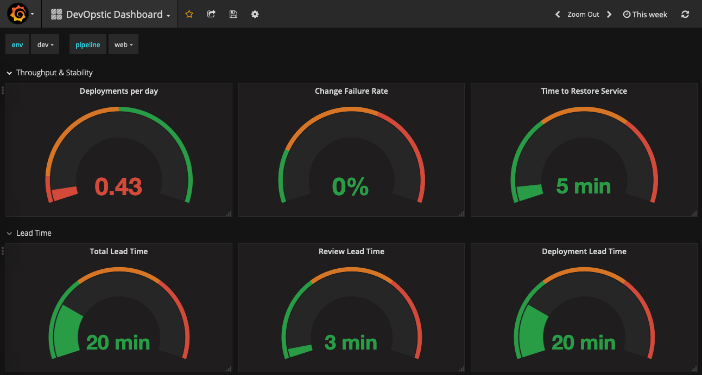
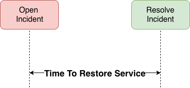

# DevOpstic

## Overview
DevOpstic allows you to store and display information related to your DevOps pipelines.

It's composed of:
- a REST api to receive events related to commit transition and incidents 
- a Postgres database for storage
- a Grafana instance to display a dashboards

The service supports its brand of events as well as GitHub webhook events (Pull Requests open and close)

## Metrics

The goal is to be able to track the following metrics, as identified in "Accelerate, Building and Scaling High Performing Technology Organization" by N. Forsgren, J. Humble & G. Kim:

- **Deployment Frequency**
- **Lead Time**
- **Mean Time To Restore (MTTR)**
- **Change Failure Rate**

**Deployment Frequency** 

Number of deployment per period of time

**Lead Time**

Time between a commit is submitted for review and the time it gets deployed.

It can be decomposed in two:
- **Review Lead Time**: from commit submitted for review to approved
- **Deployment Lead Time**: from approved to deployed successfully

**Mean Time To Restore**

Time between when an incident (failure of service) is detected to the time it is resolved.

**Change Failure Rate**

Ratio of failed deployment over total number of deployments.

*References:*
- https://stelligent.com/2018/12/21/measuring-devops-success-with-four-key-metrics/
- https://cloudplatformonline.com/2018-state-of-devops.html
- https://www.amazon.com/Accelerate-Software-Performing-Technology-Organizations-ebook/dp/B07B9F83WM

## Installation
### Docker image (api)
splisson/devopstic:v0.1

### Install on Kubernetes with Helm

From local copy of the repository:
`helm install ./helm/`

TODO: chart in repository

### Configuration
#### Database
A postgres database with a database and a user authorized to create tables.

#### API

The api requires the following environment variables:
- DEVOPSTIC_DATABASE_HOST: default: localhost
- DEVOPSTIC_DATABASE_PORT: default: 5432
- DEVOPSTIC_DATABASE_USER
- DEVOPSTIC_DATABASE_PASSWORD
- DEVOPSTIC_DATABASE_NAME: default: devopstic

For user authentication, 2 options:
- Environement variables:
  
  DEVOPSTIC_USERNAME and DEVOPSTIC_PASSWORD can be used to define the credentials that will allow to retrieve a token
  
- User table in the database: 

  TODO: implement the logic

## Documentation
- [Domain](doc/domain.md)
- [Service API Usage](doc/usage.md)
- [Database Model](doc/db_model.md)

## License
- [MIT License](license.md)